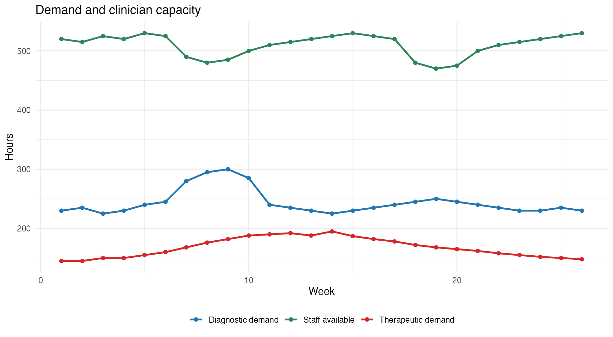
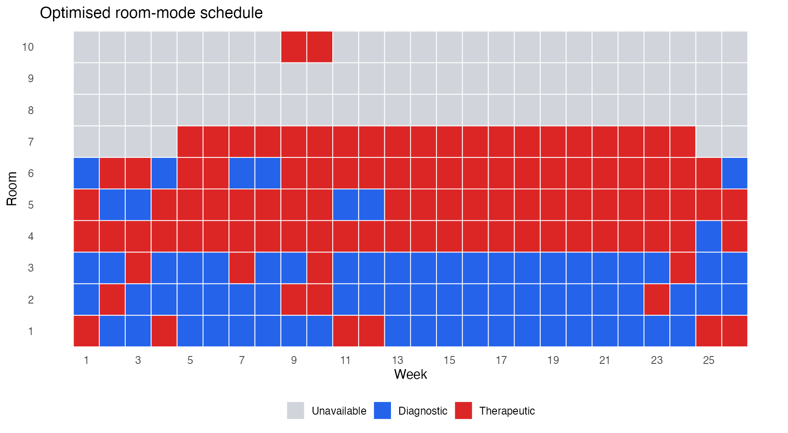
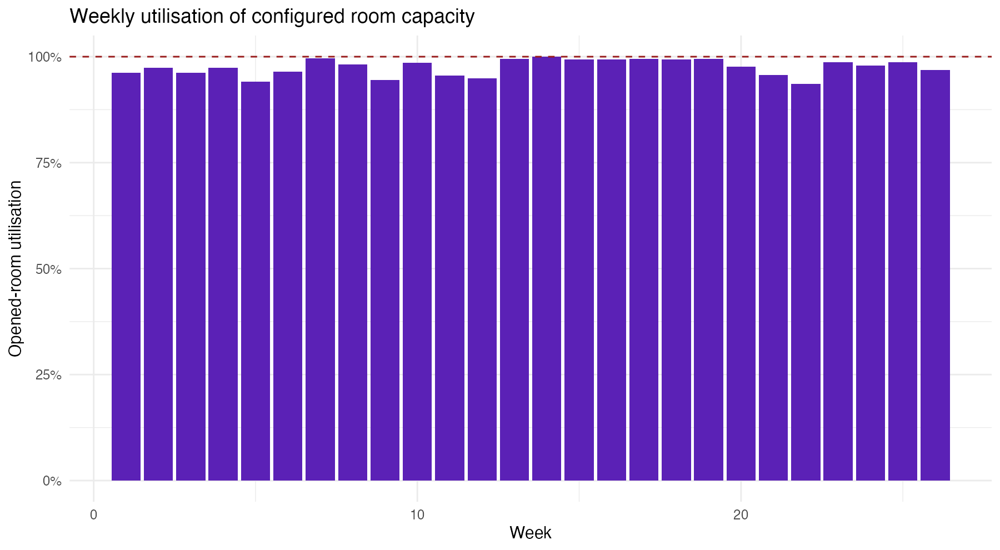

# Healthcare Capacity Optimisation in R

A mixed-integer optimisation model for assigning 10 treatment rooms across 26 weeks of diagnostic and therapeutic demand while respecting clinician capacity and room-mode constraints.

The decision variables determine which room mode opens in each week, when setup costs are incurred and how activity is allocated without breaching clinician capacity.

## Planning problem

Healthcare capacity decisions are coupled across time. Opening an additional room can protect service capacity but increases operating and setup cost; keeping capacity too tight can make the weekly demand plan infeasible. The model formalises that trade-off over a complete 26-week horizon instead of optimising each week in isolation.

The work translates a narrative case into an auditable mathematical programme: define the room-week choices, connect each choice to available diagnostic or therapeutic hours, account for clinician limits and charge for capacity activation. The output is a schedule that a manager can inspect, not only an objective value.

## My contribution

I translated the case into decision variables, constraints and a cost objective; implemented the model in R with `ompr` and HiGHS; checked feasibility against weekly demand and clinician capacity; compared the cost components; and converted the solution into room, week and utilisation views. The formulation, validation checks and management outputs are separated so the full decision can be followed from assumptions to final schedule.

## Executive result

| Result | Value |
|---|---:|
| Planning horizon | 26 weeks |
| Rooms | 10 |
| Solver | HiGHS via `ompr` / ROI |
| Presolved constraints | 832 |
| Presolved variables | 1,292 |
| Binary variables after presolve | 774 |
| Total cost | **£2,265,600** |
| Setup cost | £150,000 |
| Capacity-allocation cost | £2,115,600 |
| Reported optimality gap | **0.00883%** |

The model met diagnostic and therapeutic demand in every week, respected available clinician hours and selected exactly one operating mode per room-week.



## Decision model

Each room-week is assigned one of three modes:

- unavailable;
- diagnostic; or
- therapeutic.

Continuous variables allocate diagnostic and therapeutic hours. Binary setup indicators capture the cost of activating a room in week 1 or reopening it after a period of inactivity.

The objective minimises:

```text
room setup cost + mode-specific weekly capacity cost
```

Subject to:

1. exactly one mode per room-week;
2. all weekly diagnostic demand being met;
3. all weekly therapeutic demand being met;
4. total activity not exceeding clinician availability;
5. therapeutic work occurring only in therapeutic rooms;
6. room allocations not exceeding mode-specific capacity; and
7. setup costs being triggered when capacity is activated.

## Management output

This is a prescriptive model rather than a prediction model. Room configurations with more capacity can reduce feasibility risk but incur higher fixed operating costs. The exported weekly plan shows demand coverage, unused staff capacity, opened room capacity and setup events.

The result provides a defensible base plan. In practice, managers could rerun the same formulation under higher demand, reduced clinician availability or alternative setup costs to see where the schedule becomes fragile and which additional capacity protects the service most efficiently.

| Room schedule | Weekly utilisation |
|---|---|
|  |  |

## Repository guide

| Path | Purpose |
|---|---|
| `R/model.R` | Scenario data, MILP formulation and solution extraction |
| `R/run_analysis.R` | Reproducible model run and exports |
| `R/validate_outputs.R` | Headline and feasibility assertions |
| `outputs/` | Weekly plan, room schedule and cost summary |
| `figures/` | Saved charts for the weekly plan and utilisation |
| `tests/` | Structural tests for inputs and saved results |

## Model traceability

The repository contains the scenario assumptions, mathematical formulation, saved room schedule, weekly capacity views, cost summary and validation checks. The optimisation uses the open-source HiGHS solver. Symmetric rooms can produce different room-level schedules with the same objective, so the decision is evaluated through feasibility, total cost and capacity use rather than one arbitrary room label.

## Limitations

- Demand and staff availability are treated as known rather than uncertain.
- The objective prices configured capacity, not realised patient waiting or overtime.
- Room types within each size band are symmetric.
- The case is a planning scenario, not a live NHS deployment.

## Author

**Muhammad Ahmed Shoaib**<br>
Optimisation, operations analytics and decision support.
